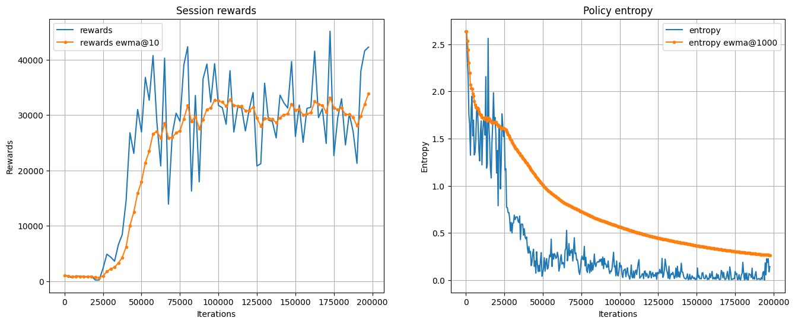

# Deep Kung-Fu with Advantage Actor-Critic

This project implements a deep reinforcement learning agent for the Atari Kung-Fu Master game using a modified version of the Advantage Actor-Critic (A2C) algorithm. The implementation is done in PyTorch and uses the Gymnasium library for the Atari environment.

## Table of Contents
1. [Introduction](#introduction)
2. [Project Structure](#project-structure)
3. [Network Architecture](#network-architecture)
4. [The Kung-Fu Master Environment](#the-kung-fu-master-environment)
   - [Environment Setup for training](#environment-setup-for-training)
   - [Environment Characteristics](#environment-characteristics)
   - [Challenges for Reinforcement Learning](#challenges-for-reinforcement-learning)
5. [Agent Implementation](#agent-implementation)
6. [Training Process](#training-process)
7. [Reward Scaling and Gradient Explosion](#reward-scaling-and-gradient-explosion)
   - [Sanity Check for Entropy](#sanity-check-for-entropy)
8. [Improved Agent](#improved-agent)
   - [Reward Shaping Strategy](#reward-shaping-strategy)
   - [Implementation Details](#implementation-details)
   - [Expected Outcomes](#expected-outcomes)
9. [Untrained Agent](#untrained-agent)
10. [Results and Comparison](#results-and-comparison)
    - [Standard agent with reward scaling](#1-standard-agent-with-reward-scaling)
    - [Agent without reward scaling (exploding gradient)](#2-agent-without-reward-scaling-exploding-gradient)
    - [Improved agent with a custom reward function](#3-improved-agent-with-a-custom-reward-function)
11. [Conclusion](#conclusion)
12. [References](#references)

## Introduction

This project implements a deep reinforcement learning agent for the Atari Kung-Fu Master game using a modified version of the Advantage Actor-Critic (A2C) algorithm. While not a true Asynchronous Advantage Actor-Critic (A3C) implementation, the approach utilizes a batch environment that shares some conceptual similarities with asynchronous methods. The implementation is done in PyTorch and uses the Gymnasium library for the Atari environment.

The method employs parallel environment interactions through batching, which allows for diverse experience collection and reduced correlation in training data, similar to some benefits of A3C. However, it maintains a synchronous update scheme and uses a single shared network, striking a balance between the complexity of fully asynchronous methods and the simplicity of traditional synchronous approaches.
Initially, three different agents were developed and compared:

- A standard agent with reward scaling: This agent demonstrated high scores but exhibited "reward hacking" behavior. Reward hacking occurs when an agent finds a way to maximize its reward that doesn't align with the intended goal of the task. In this case, the agent learned to exploit a repetitive strategy that scored well but didn't demonstrate true mastery of the game.
- An agent without reward scaling: This agent was created to demonstrate the "exploding gradient" problem. Exploding gradients occur when large error gradients accumulate, leading to very large updates to neural network weights during training. This results in unstable and often poor learning.
- An improved agent with a custom reward function: This agent was developed in response to the reward hacking behavior of the first agent. It uses a more complex reward shaping strategy to encourage more dynamic and strategic gameplay.

The goal of this project was to explore actor-critic methods combined with batch processing in an attempt to reach decent performance in the Kung-Fu Master game environment, while also addressing common challenges in reinforcement learning such as reward hacking and exploding gradients.

## Project Structure

The project consists of several Python files and a Jupyter notebook:

1. `agent.py`: Defines the Agent class with the neural network architecture.
2. `atari_util.py`: Contains utility functions for preprocessing the Atari game frames.
3. `environment.py`: Implements environment wrappers and batching for parallel training.
4. `reward_scaler.py`: Implements a reward scaling mechanism.
5. `training.py`: Contains functions for training and evaluating the agent.
6. `utils.py`: Provides utility functions for data analysis and visualization.
7. `A3C_KungFuMaster.ipynb`: Jupyter notebook with training execution and visualizations.

## Network Architecture

The neural network implemented using a simplified version of the Advantage Actor-Critic (A2C) algorithm has some key differences to the A3C algorith which are:

1. This implementation does not use multiple parallel actors running on different threads or processes.
2. It uses a single neural network to compute both the policy (actor) and value function (critic), rather than separate networks.

The network architecture consists of convolutional layers for processing game frames, followed by fully connected layers that output both the policy and value function. Bellow is a visual representation of the network:

The network architecture can be broken down as follows:

1. Input Layer: Receives a 4x42x42 tensor (4 stacked, preprocessed game frames)
2. Convolutional Layers: Three Conv2D layers, each followed by ReLU activation
3. Flatten Layer: Converts the 2D feature maps to a 1D vector
4. Fully Connected Layer: A linear layer that reduces the flattened vector to 128 features
5. Output Layers:
   - Actor: A linear layer that outputs logits for each possible action
   - Critic: A linear layer that outputs a single value representing the state value

This architecture allows the network to process the visual input of the game, extract relevant features, and simultaneously predict the best action to take (actor) and the value of the current state (critic).

## The Kung-Fu Master Environment

### Environment Setup for training

The Atari Kung-Fu Master environment is set up using the Gymnasium library. The setup includes:

- Creating the Kung-Fu Master environment
- Preprocessing the game frames (resizing, cropping, grayscale conversion)
- Stacking 4 consecutive frames as input to the agent
- Adding compatibility wrappers for different Gymnasium versions
- Optional video recording functionality

Here's a visualization of the environment setup process:

This figure shows:
1. The original game frame as rendered by the Atari emulator.
2. The cropped frame, which removes some non-essential parts of the image.
3. The agent's observation, which is a 42x42 grayscale image created by combining 4 consecutive preprocessed frames.

The preprocessing steps are crucial for reducing the input dimensionality and focusing on the most relevant parts of the game state. By stacking multiple frames, the agent is provided with information about movement and temporal changes in the game state.

Environment details:
- Observation shape: (4, 42, 42)
- Number of actions: 14
- Action names: ['NOOP', 'UP', 'RIGHT', 'LEFT', 'DOWN', 'DOWNRIGHT', 'DOWNLEFT', 'RIGHTFIRE', 'LEFTFIRE', 'DOWNFIRE', 'UPRIGHTFIRE', 'UPLEFTFIRE', 'DOWNRIGHTFIRE', 'DOWNLEFTFIRE']

This setup allows the agent to interact with the Kung-Fu Master game environment in a way that balances computational efficiency with the preservation of essential game information.

### Environment Characteristics

1. **Reward Structure**: 
   - The game provides sparse, large rewards rather than frequent, small ones.
   - Rewards are primarily given for defeating enemies.
   - Weak enemies typically award 100 points, while stronger enemies give more.
   - No immediate reward is given for most actions or movements.

2. **State Information**:
   - The environment provides an `info` dictionary with each step, containing:
     - `lives`: The current number of lives the player has (starts at 4).
     - `episode_frame_number`: The number of frames elapsed in the current episode.
     - `frame_number`: The total number of frames elapsed since the environment was created.

3. **Game Mechanics**:
   - The game uses a lives system, starting with 4 lives.
   - Score doesn't decrease upon taking damage; instead, the health bar (not directly observable) decreases.
   - The environment uses a frame skip of 4, meaning each action is repeated for 4 frames.

### Challenges for Reinforcement Learning

1. **Sparse Rewards**: The large, infrequent rewards make it difficult for the agent to associate actions with outcomes.
2. **Delayed Consequences**: The impact of actions (like taking damage) isn't immediately reflected in the reward signal.
3. **Complex Strategy Required**: The agent needs to balance aggression (to defeat enemies and score points) with survival (to avoid losing lives).

## Agent Implementation

The agent is implemented in the `Agent` class in `agent.py`. It includes methods for:
- Forward pass through the network
- Choosing actions based on the current policy

The agent uses a single network to compute both the policy logits and state values, which are then used in the actor-critic algorithm.

## Training Process

The training process involves:
1. Environment batching for parallel simulations
2. Computation of actor and critic losses
3. Entropy regularization to encourage exploration
4. Reward scaling to stabilize training

The main training loop performs action selection, environment interaction, loss computation, and network updates.

## Reward Scaling and Gradient Explosion

An important aspect of this implementation is the use of reward scaling. The rewards in the Kung-Fu Master game are multiples of 100, which can lead to large gradients and potential instability in training. To address this, the rewards are scaled down by a factor of 0.01.

To demonstrate the importance of reward scaling an agent without scaling was trained (the "exploding gradient" version). This agent is trained for a shorter number of iterations because it quickly collapses without reward scaling.

### Sanity Check for Entropy

A sanity check for the entropy of the policy is also computed. This check ensures that:
1. The entropy is non-negative and doesn't exceed the maximum possible entropy (log of the number of actions).
2. For an untrained agent, the entropy should be relatively high (close to the maximum), indicating a near-uniform action distribution.

## Improved Agent

This agent was created due to the "reward-hacking" behaviour shown by the original agent. To tackle this I created an improved agent with changes to the reward function to avoid reward hacking.
1. Modified reward structure in the `ImprovedEnvWrapper`
2. Updated loss computation
3. Gradient clipping to prevent extreme updates

These improvements aim to stabilize training and potentially achieve better performance.

### Reward Shaping Strategy

To address the "reward-hacking", the `ImprovedEnvWrapper` was created to better shape the rewards from the game environment:

1. **Enemy Defeat Bonus**:
   - When a positive reward is received (indicating an enemy defeat), we add a bonus scaled to the enemy's strength.
   - This reinforces the importance of defeating enemies and provides more frequent positive feedback.

2. **Life Preservation**:
   - We apply a significant penalty (-5.0) when a life is lost.
   - This encourages the agent to avoid taking damage and play more cautiously.

3. **Active Gameplay Encouragement**:
   - A small reward (+0.1) is given for actions taken shortly after defeating an enemy.
   - This encourages the agent to capitalize on successful attacks and maintain momentum.

4. **Exploration Incentive**:
   - If the agent goes too long without defeating an enemy (500 steps), we apply a small penalty (-0.05).
   - This discourages inactive or overly cautious gameplay and promotes exploration.

5. **Combo Reward**:
   - A bonus (+0.5) is given for defeating enemies in quick succession.
   - This encourages the agent to chain attacks and develop more advanced strategies.

### Implementation Details

- The `ImprovedEnvWrapper` class modifies the reward signal based on the above strategy.
- It maintains state across steps (e.g., previous lives, steps since last kill) to implement these rules.
- The wrapper is designed to be compatible with both old (4-value return) and new (5-value return) Gym API formats.

### Expected Outcomes

This reward shaping strategy aims to:
1. Make the learning process more stable by providing more frequent, meaningful feedback.
2. Encourage a balance between aggressive play (to score points) and cautious play (to preserve lives).
3. Develop more advanced strategies like chaining attacks and actively seeking out enemies.
4. Improve the agent's ability to learn from the sparse, delayed rewards inherent in the game.

This approach should lead to an agent that plays KungFuMaster more effectively, demonstrating both skilled combat and strategic gameplay.

## Untrained Agent

To demonstrate the initial behavior of the agent before training, here are videos of the untrained agent:

1. Untrained Agent - Episode 1

https://github.com/user-attachments/assets/744112af-c914-4484-89bf-f7494a717734

3. Untrained Agent - Episode 2
   
https://github.com/user-attachments/assets/74ae719e-c0db-4fb1-95d9-0975b940a9d6

5. Untrained Agent - Episode 3
   
https://github.com/user-attachments/assets/1b5063f1-ab70-43c6-8328-b0a123512b09

These videos show the random actions taken by the agent before any learning has occurred, these serve as the baseline that we wish to overcome.

## Results and Comparison

I compared three different agent implementations:
1. Standard agent with reward scaling
2. Agent without reward scaling (exploding gradient)
3. Improved agent with a custom reward function 

For the comparisons there are 2 plots:
1. Rewards Comparison: Shows the raw rewards for each agent over training iterations, these are the scores for the actual game. At each evaluation step agents face a new environment and that score is shown.
3. Entropy Comparison: Illustrates how the policy entropy of each agent changes during training, indicating exploration vs. exploitation balance.

### 1. Standard agent with reward scaling:

As can be seen in the plot above, at around 50,000 iterations the agent learns a very effective policy for reaching very high scores. Training for a further 150,000 iterations does not improve the agents scores. By the end of training, entropy pretty much reaches zero indicating that the policy has converged and there is little action variety in the agents behaviour. This low entropy was immedieatly a red flag because the game environment involves dodging ducking and jumping over projectiles as well as attacking enemies. 

Here is the video of this agent in the game environment:

https://github.com/user-attachments/assets/0db90b7e-3edb-470b-893b-4ea40dd9287b

As can be seen in the video, the agent converged on a repetitive strategy of ducking and attacking rapidly. While this strategy seems to work well for obtaining high scores it will not generalize well in a more diverse environment with more varied atacks from enemies. 

### 2. Agent without reward scaling (exploding gradient)

The unscaled agent, as shown in the plot, demonstrates the importance of reward scaling in reinforcement learning. Without scaling, the agent fails to learn effectively, with rewards rapidly collapsing to near-zero after an initial spike. This behavior is indicative of the "exploding gradient" problem. The large, unscaled rewards (multiples of 100 in Kung-Fu Master) lead to extreme gradients during backpropagation, causing drastic and unstable updates to the network weights. Consequently, the agent's policy becomes erratic and ineffective, as evidenced by the unstable entropy levels. This agent was trained for 50,000 iterations because its quick colapse warrented no further exploration if training time would cause it to improve.

https://github.com/user-attachments/assets/227d756c-fd4d-46ae-80ac-7f827463c7c4

The video confirms that the agent does mostly nothing ot atacks at random reflecting how the lack of scaling prevents the agent from converging on a strategy. This is simply a demonstration of how scalling rewards is so important for RL problems.

### 3. Improved agent with a custom reward function 

In an atempt to solve the "reward hacking" behaviour of the original agent, I shaped the reward function by implementing some specific rewards that I figured could assist in learning a more robust playstyle. I let the agent train for much longer and still it seemed to be increasing in performance but in the interest of this project I found 1 million iterations to be long enough, the agent reached high scores comparable to the original agent.

Here is the video of this agent in the game environment:

https://github.com/user-attachments/assets/c52220e9-261e-44d8-b089-bd5de6f1be6e

As can be seen by the video this agent is much more dynamic in movement and much more deliberate in attacking enemies. Some movements are still wasted probably due to the exploration incentive. The agent shows some instances of dodging knives (perhaps randomly but it does occur more than once) which is a very important part of progressing in the game. The agent struggles with the knife throwing enemies but the normal enemies are no longer an issue rarelly causing any damage and being easily dispatched. Overall, the reward shapping strategy was a success and did in fact improve the agents behaviour.

## Conclusion

This project demonstrates the implementation of a simplified Advantage Actor-Critic algorithm for playing Atari Kung-Fu Master. It highlights the importance of reward scaling in stabilizing the training process and shows how various improvements can enhance the agent's performance.

The comparison between different agent implementations provides insights into the effects of reward scaling and how shapping the reward functions is an important step to getting agents to behave as desired and to avoid the pitfalls of "reward-hacking"

## References
This was a project started during the Udemy course:
- Artificial Intelligence A-Z 2024: Build 7 AI + LLM & ChatGPT 
   - Created by Hadelin de Ponteves, Kirill Eremenko, SuperDataScience Team, Luka Anicin and the Ligency Team
   - https://www.udemy.com/share/101Wpy3@8EUG1WmSHuIQ8NJ8MqbUIKERQL-i115amp8Wv-vEns_QefgYHXhNbCiRxagVIsqkvA==/

I would also like to acknowledge for some great exploration and visualization ideas that I used from their implementations:
- Jesse Grabowski: [Coursera](https://www.coursera.org/learn/practical-rl/discussions/all/threads/6iDjkbhPQoGg45G4T7KBHQ/replies/5eM_hA7vEeuoKgpcLmLqdw)
- amirabbasii: [Github](https://github.com/amirabbasii/A3C_Kung_Fu/blob/main/Code.ipynb)

